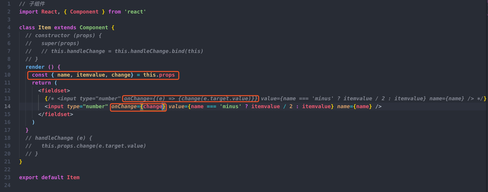
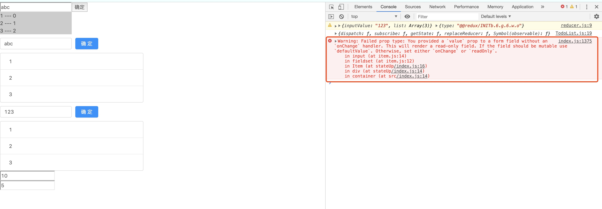

react学习笔记
==
## 1.props传递事件

提示没有写onChange处理器，但是我确实写了。具体原因还不清楚。

错误之处有两种改写方法：

    onChange={(e) => change(e.target.value)}

    onChange={this.handleChange}
    handleChange (e) {
      this.props.change(e.target.value)
    }

