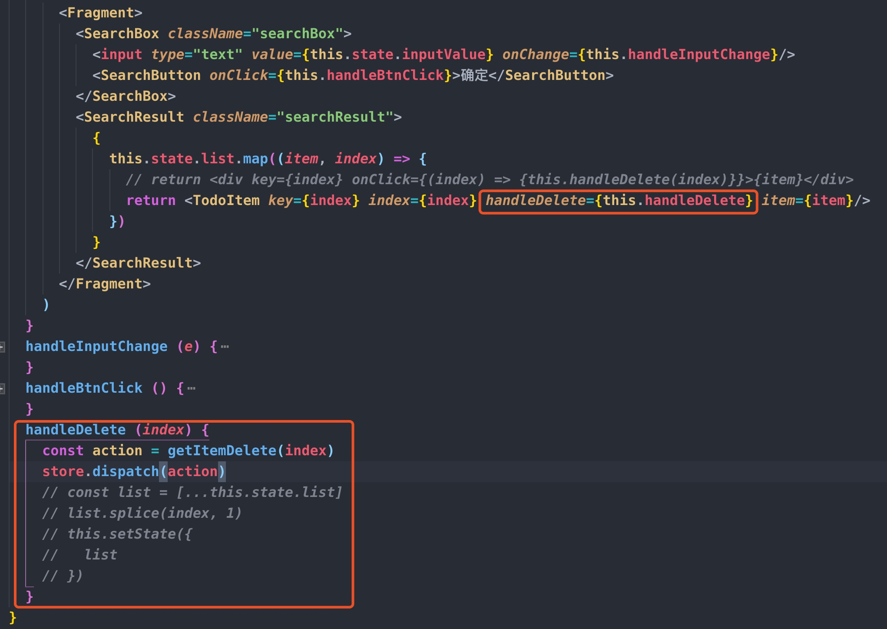
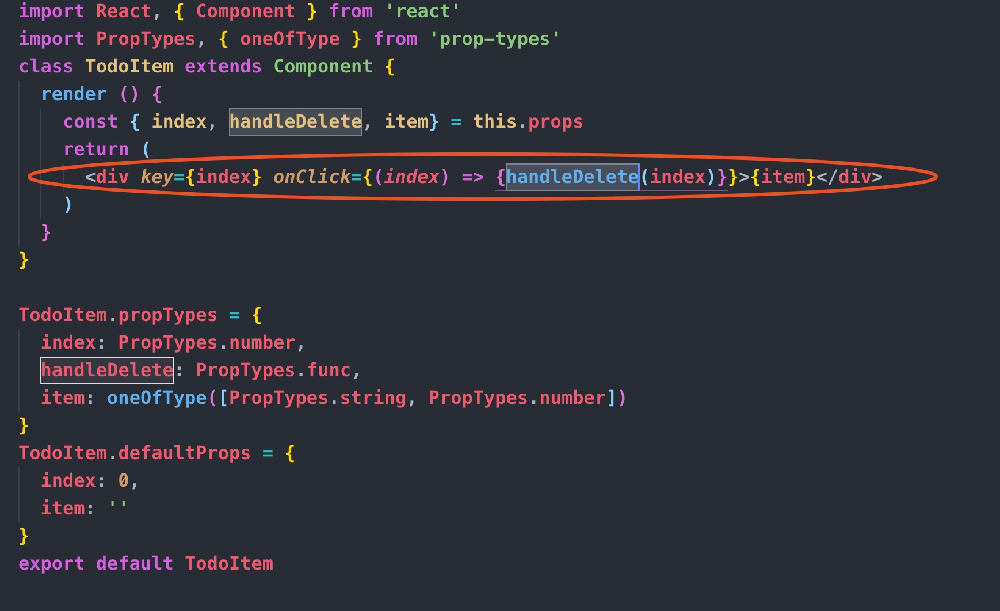
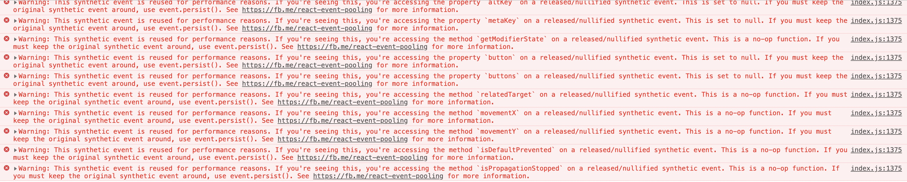

react学习笔记
==
## 1.props传递事件


提示没有写onChange处理器，但是我确实写了。具体原因还不清楚。

错误之处有两种改写方法：
```js
  onChange={(e) => change(e.target.value)}

  onChange={this.handleChange}
  handleChange (e) {
    this.props.change(e.target.value)
  }
```

## 2.props传递事件时，该事件内发送action出现异常
#### 父组件内代码

#### 子组件内代码

#### 错误信息代码


错误描述：
  (1)父组件内通过props向子组件传递事件，该事件内向redux发送action
  (2)点击事件触发后，控制台报错。
  
错误原因：
```js
  onClick={(index) => handleDelete(index)}
  onCLick={() => handleDelete(index)}
```
(1) (index) => handleDelete(index),事件绑定的回调参数第一个是event,
(2) 即使不论原因1，这种写法的index，也会是一个形参，而不是实参。！！！